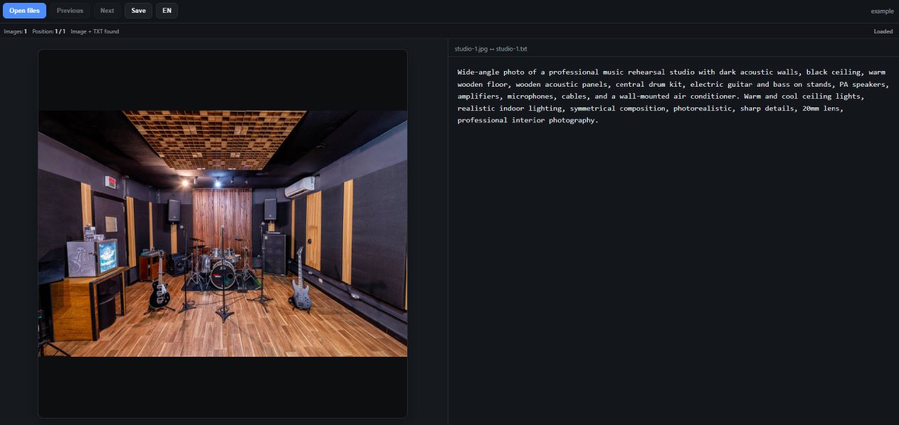

<div align="center">

# Caption Editor
**Custom HTML for editing captions from images.**


</div>

**Caption Editor** is a lightweight, browser-based tool designed to make image captioning faster and more convenient.

It displays an image and its corresponding text file side by side, allowing you to review, create, and edit captions without constantly switching between applications or files.

The project was created primarily to assist with dataset preparation for AI image training workflows, where each image is associated with a .txt caption file.

No installation, backend, database, or server is required.

Simply open the HTML file in a supported browser and start working.

## Features
### Side-by-side image and caption editor
- The interface is divided vertically into two equal sections:
  - Left side: Image preview
  - Right side: Editable caption text
This makes it easy to see the image while writing or reviewing its caption.

**Folder selection**
Click "Open Files" and select the folder containing your dataset.

Caption Editor automatically scans the selected directory and loads the supported images.

Example directory:
```Dataset/
├── IMG (1).jpg
├── IMG (1).txt
├── IMG (2).jpg
├── IMG (2).txt
├── IMG (3).png
├── IMG (3).txt
└── IMG (4).jpg
```

**Automatic image and caption matching**
Images are automatically matched with .txt files that have the same filename.

For example:
```
IMG (1).jpg
IMG (1).txt
```

The image will be displayed on the left while the corresponding text file is loaded into the editor on the right.

**Automatic caption file creation**
If an image does not already have a corresponding .txt file, you can still write a caption normally.

For example:
```
IMG (15).jpg
```
If:
```
IMG (15).txt
```
Does not exist, Caption Editor will create it automatically when you click Save.

**Direct file saving**
Edited captions are saved directly back to their corresponding .txt files inside the selected folder.

There is no need to download or export captions manually.

**Image navigation**
Use the navigation controls to move through your dataset:
- Previous
- Next

The application processes the images one at a time, making it suitable for reviewing large caption datasets.

**Image counter**
Below the main toolbar, Caption Editor displays the current position inside the dataset.

Example:
```
17 / 284
```

This allows you to quickly see:
- The total number of images loaded
- Your current position in the dataset

**Caption status**
The interface displays the current state of the caption.

Depending on the situation, it can indicate whether:
- A caption file was found
- A caption file does not exist yet
- The current caption has been saved
- There are unsaved changes

**Unsaved changes protection**
If you modify a caption and attempt to move to another image before saving, Caption Editor warns you about the unsaved changes.

This helps prevent accidental loss of caption edits.

**Image preview**
Images are displayed inside a square 1:1 preview area.

The original image aspect ratio is preserved.

Smaller images are not unnecessarily stretched, while larger images are automatically scaled to fit the available preview area.

**Supported image formats**

Caption Editor currently supports:
```
.jpg
.jpeg
.png
.webp
.bmp
.gif
.avif
```

**Natural filename sorting**
Images are sorted naturally.

For example:
```
IMG (1)
IMG (2)
IMG (3)
IMG (10)
```

Instead of:
```
IMG (1)
IMG (10)
IMG (2)
IMG (3)
```

This is especially useful for datasets containing numbered filenames.

**Keyboard shortcuts**
Caption Editor includes a few shortcuts to speed up the captioning workflow.

| Shortcut | Action |
| -------- | ------ |
| Ctrl + S | Save current caption |
| Alt + Left Arrow | Previous image |
| Alt + Right Arrow | Next image |

**Language selection**
The interface supports:
- English
- Portuguese — Brazil

Use the EN / BR button in the toolbar to switch languages instantly.

English is the default language when Caption Editor is opened.

The language selector only affects the application interface. Your caption text is never translated or modified.

**No installation required**
Caption Editor is contained in a single HTML file.

You do not need:
```
Node.js
Python
PHP
Docker
A web server
A database
Any additional dependencies
```

Just open the HTML file in your browser.

**Browser compatibility**
Caption Editor uses the browser's File System Access API in order to read and modify files directly inside the selected folder.

For the best compatibility, use a Chromium-based browser such as:
- Google Chrome
- Microsoft Edge

When selecting a folder, the browser will request permission to access its files.

This permission is required so Caption Editor can read existing captions and save changes directly to the .txt files.

## Privacy
Caption Editor runs locally in your browser.

Your images and captions are not uploaded to a remote server by the application.

Files remain on your computer and are accessed directly through the browser's local file access capabilities.

## Possible future improvements
Some features that may be added in future versions include:
- Save and automatically move to the next image
- Image zoom controls
- Caption character counter
- Token counter
- Autosave
- Additional keyboard shortcuts
- Dataset file list
- Direct navigation to a specific image
- Caption search
- Optional automatic creation of missing .txt files
- Customizable interface settings

## License
See [LICENSE](LICENSE).